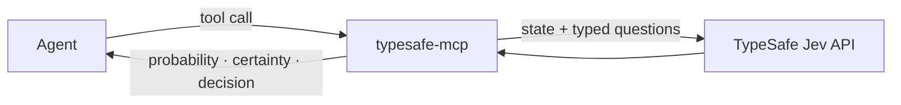

<div align="center">

# typesafe-mcp

**Deterministic decisions for AI agents — powered by TypeSafe AI's Jev.**

[](https://www.npmjs.com/package/typesafe-mcp)
[](https://github.com/MarkChu-git/typesafe-mcp/actions/workflows/ci.yml)
[](LICENSE)
[](https://bun.sh)

[npm](https://www.npmjs.com/package/typesafe-mcp) · [Documentation](#tools) · [Issues](https://github.com/MarkChu-git/typesafe-mcp/issues) · [Releases](https://github.com/MarkChu-git/typesafe-mcp/releases)

</div>

<br>

An MCP server that wraps **Jev**, TypeSafe AI's System One decision model, so **any agent** can ask typed questions and get structured, auditable answers back — probabilities, confidence, and a threshold-gated `act / review / abstain` verdict. No generated text, no vibes.



- **Jev** — TypeSafe AI's hosted decision model (`jev-latest` / `jev-1.13.0`). Evaluates a `state` plus typed questions (Noul / Choice / Score) and returns structured answers. It does **not** generate text, code, or explanations.
- **TypeSafe** — the company and API (`api.typesafe.ai/v1/systemone`) plus official JS/Python SDKs.
- **This server** — a type-safe MCP wrapper. `decision` is computed in code by this server, never Jev's own opinion about whether you may proceed.

## Install

Add to any MCP host config — Cursor, Claude Desktop, Claude Code, Windsurf, Cline, or a custom stdio client:

```json
{
  "mcpServers": {
    "jev": {
      "command": "bunx",
      "args": ["typesafe-mcp"],
      "env": {
        "TYPESAFE_API_KEY": "<paste-your-key-here>",
        "TYPESAFE_DEFAULT_MODEL": "jev-latest"
      }
    }
  }
}
```

Requires [Bun](https://bun.sh) on PATH. That's it — the host spawns a bundled single-file build over stdio. Without a key the server still connects and lists tools; calls return a `CONFIG:` error telling you where to put it.

<details>
<summary>Running from source</summary>

```bash
git clone https://github.com/MarkChu-git/typesafe-mcp.git && cd typesafe-mcp
bun install
bun run start        # stdio server — exits immediately if stdin closes
```

Point the host at the repo path instead — see [examples/stdio.mcp.json](examples/stdio.mcp.json) and replace `/ABSOLUTE/PATH/TO/typesafe-mcp` (`cursor.mcp.json` / `claude-desktop.json` are the same shape for their respective hosts).

</details>

## What it looks like

```jsonc
// jev_check — "Does this ticket convey urgency?"
// state: "Help! My payouts have been failing for 3 days."
{
  "type": "noul",
  "probability": 0.95,
  "answer": true,
  "certainty": 0.9,            // |0.95 − 0.5| × 2
  "decision": "act",           // 0.9 ≥ act_above 0.8
  "thresholds": { "act_above": 0.8, "review_above": 0.5 },
  "model": "jev-1.13.0",
  "usage": { "input_tokens": 307, "output_tokens": 20 }
}
```

## Tools

| Tool | Question type | Input | Returns |
| --- | --- | --- | --- |
| `jev_models` | — | — | `models[]`, `default_model` — health check, no inference tokens |
| `jev_check` | Noul | `state`, `question` | `probability` (0–1 yes), `answer` |
| `jev_classify` | Choice | `state`, `question`, `options` (2–255) | `choice`, `probabilities`, `confidence` |
| `jev_score` | Score | `state`, `question`, `levels` (2–10) | `score` (expected value), `legend`, `probabilities`, `confidence` |
| `jev_ask` | Mixed | `state`, `questions` (record keyed by your ids) | `answers` — **one** upstream call for the whole batch, ~10× cheaper |

Every answer also carries `certainty`, `decision`, `thresholds`, `model`, and `usage`.

## Decision gating

| Field | Meaning |
| --- | --- |
| `certainty` | Noul: `\|probability − 0.5\| × 2` · Choice/Score: API `confidence` |
| `decision` | `certainty ≥ act_above` → `act` · `≥ review_above` → `review` · else `abstain` |
| `thresholds` | Defaults `act_above 0.8`, `review_above 0.5` — overridable per call (`review_above ≤ act_above`), echoed back so the gate is auditable |

Pin `model` to a versioned id (e.g. `jev-1.13.0`) once thresholds are tuned — `jev-latest` can drift under a calibrated gate.

**中文提示**：`question`/`state` 支持中文，官方建议英文——Jev 按字面理解，中文问题准确率略低。`decision`/`certainty`/`thresholds` 语义与语言无关。

## Errors

Every failure returns `isError: true` with a category prefix:

| Category | Cause |
| --- | --- |
| `CONFIG` | `TYPESAFE_API_KEY` missing — where to set it is in the message |
| `VALIDATION` | Bad arguments — names the offending field |
| `AUTH` | API rejected the key |
| `RATE_LIMIT` | Throttled — hint: batch questions through `jev_ask` |
| `OVERLOADED` / `UPSTREAM` | API-side 5xx after retries |
| `TIMEOUT` / `NETWORK` | Exceeded `TYPESAFE_TIMEOUT_MS` (default 10s) / unreachable API |
| `INVALID_REQUEST` | API rejected the payload (422) — includes field path |

Keys are redacted from error text; diagnostics go to stderr, never stdout.

## Development

Bun only — no Node/npm/pnpm/yarn/`npx`.

```bash
bun test                 # unit + in-process MCP tests (no key needed)
bun run test:integration # live API — skips entirely without TYPESAFE_API_KEY
bun run typecheck        # tsc --noEmit
bun run lint             # oxlint
bun run inspect          # MCP Inspector over stdio
bun run scripts/record-fixture.ts   # re-record tests/fixtures from the real API (needs key)
```

CI: `tsc` + `oxlint` + `bun test` on Ubuntu (required) and macOS/Windows, CodeQL, dependency review, actionlint, zizmor. Releases publish via OIDC trusted publishing with `--provenance` — no long-lived npm token. See [CONTRIBUTING.md](CONTRIBUTING.md).

## Roadmap

Not implemented yet:

- Streamable HTTP transport (`createMcpHandler` + Hono/`Bun.serve`) for remote/shared deployments
- Object-shaped `instructions` on questions (structured prompts referencing `state` fields)
- Opinionated tools (`jev_gate` / `jev_screen` / `jev_match`) — pending the first business-scenario decision

## License

[MIT](LICENSE) · Research notes: [docs/research-jev-typesafe-mcp.md](docs/research-jev-typesafe-mcp.md) · Plan: [docs/plan-build-jev-mcp.md](docs/plan-build-jev-mcp.md)
