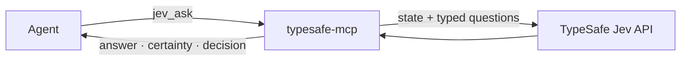

<div align="center">

# typesafe-mcp

**Deterministic decisions for AI agents — powered by TypeSafe AI's Jev.**

[](https://www.npmjs.com/package/typesafe-mcp)
[](https://github.com/MarkChu-git/typesafe-mcp/actions/workflows/ci.yml)
[](LICENSE)
[](https://bun.sh)

[npm](https://www.npmjs.com/package/typesafe-mcp) · [Documentation](#tools) · [Issues](https://github.com/MarkChu-git/typesafe-mcp/issues) · [Releases](https://github.com/MarkChu-git/typesafe-mcp/releases)

</div>

<br>

An MCP server that wraps **Jev**, TypeSafe AI's System One decision model, so **any agent** can ask typed questions and get compact, auditable answers back — the answer, how certain Jev is, and a threshold-gated `act / review / abstain` verdict. No generated text, no vibes, and as few tokens of the agent's context as possible.

```bash
bunx typesafe-mcp        # stdio server — add to any MCP host config, done
```


```mermaid
flowchart LR
    A[Agent] -->|jev_ask| M[typesafe-mcp]
    M -->|state + typed questions| J[TypeSafe Jev API]
    J --> M
    M -->|answer · certainty · decision| A
```

- **Jev** — TypeSafe AI's hosted decision model (`jev-latest` / `jev-1.13.0`). Evaluates a `state` plus typed questions (Noul / Choice / Score) and returns structured answers. It does **not** generate text, code, or explanations.
- **TypeSafe** — the company and API (`api.typesafe.ai/v1/systemone`) plus official JS/Python SDKs.
- **This server** — a type-safe MCP wrapper. `decision` is computed in code by this server, never Jev's own opinion about whether you may proceed.

## Install

Add to any MCP host config — Cursor, Claude Desktop, Claude Code, Windsurf, Cline, or a custom stdio client:

```json
{
  "mcpServers": {
    "jev": {
      "command": "bunx",
      "args": ["typesafe-mcp"],
      "env": {
        "TYPESAFE_API_KEY": "<paste-your-key-here>",
        "TYPESAFE_DEFAULT_MODEL": "jev-latest"
      }
    }
  }
}
```

Requires [Bun](https://bun.sh) on PATH. That's it — the host spawns a bundled single-file build over stdio. Without a key the server still connects and lists tools; calls return a `CONFIG:` error telling you where to put it.

| Env var | Default | Meaning |
| --- | --- | --- |
| `TYPESAFE_API_KEY` | — | Required for calls |
| `TYPESAFE_DEFAULT_MODEL` | `jev-latest` | Model used when a call does not pass `model` |
| `TYPESAFE_TIMEOUT_MS` | `10000` | Per-request timeout |
| `TYPESAFE_TOOLS` | `jev_ask` | Tools to expose: `all`, or a list such as `ask,models` |
| `TYPESAFE_FILES_ROOT` | the host's MCP roots | Directory `files` may read, for hosts that do not share roots |

**Upgrading from 0.1.x:** only `jev_ask` is on by default, and answers are now `{answer, certainty, decision}`. Set `TYPESAFE_TOOLS=all` to keep all five tools. The [v0.2.0 release notes](https://github.com/MarkChu-git/typesafe-mcp/releases/tag/v0.2.0) list every change.

<details>
<summary>Running from source</summary>

```bash
git clone https://github.com/MarkChu-git/typesafe-mcp.git && cd typesafe-mcp
bun install
bun run start        # stdio server — exits immediately if stdin closes
```

Point the host at the repo path instead — see [examples/stdio.mcp.json](examples/stdio.mcp.json) and replace `/ABSOLUTE/PATH/TO/typesafe-mcp` (`cursor.mcp.json` / `claude-desktop.json` are the same shape for their respective hosts).

</details>

## What it looks like

```jsonc
// jev_ask — state: "Help! My payouts have been failing for 3 days."
// questions: urgent (noul), dept (choice: billing / technical / sales), anger (score: Calm / Frustrated / Very angry)
{
  "answers": {
    "urgent": { "answer": true, "certainty": 0.9, "decision": "act" },        // p(yes) 0.95 → |0.95 − 0.5| × 2
    "dept": { "answer": "billing", "certainty": 0.81, "decision": "act" },
    "anger": { "answer": 1.05, "certainty": 0.92, "decision": "act" }         // expected level index
  }
}
```

That object is all the agent reads. Pass `"detailed": true` to add `probability` (noul) or `probabilities` (choice / score). The Jev model, token usage and the thresholds applied travel in the result's `_meta["typesafe.ai/jev"]`, which hosts keep out of the model's context.

To ask the same questions of many files, pass `files` instead of `state`. The server reads the files itself, so the agent neither copies their contents nor repeats the questions per item:

```jsonc
// jev_ask — files: "tickets/*.md", context: "Urgent means a customer's money is stuck."
{
  "files": {
    "tickets/T001.md": { "urgent": { "answer": true, "certainty": 0.9, "decision": "act" } },
    "tickets/T002.md": { "urgent": { "answer": false, "certainty": 0.84, "decision": "act" } }
  },
  "errors": { "tickets/big.md": "81 KB is over the 64 KB limit" }   // only when something was skipped
}
```

## Tools

By default the server exposes one tool, `jev_ask`, which covers every question type. Set `TYPESAFE_TOOLS` to choose the tools instead: `all`, or a list such as `ask,check` (the list replaces the default).

| Tool | Exposed | Input | `answer` |
| --- | --- | --- | --- |
| `jev_ask` | default | `state` or `files` (+ optional `context`), `questions` (your ids → `{type, question, options \| levels \| criteria}`) | per question — **one** upstream call per state, or per file |
| `jev_check` | `TYPESAFE_TOOLS` | `state`, `question`, optional `criteria` | `true` / `false` |
| `jev_classify` | `TYPESAFE_TOOLS` | `state`, `question`, `options` (2–255) | the chosen label |
| `jev_score` | `TYPESAFE_TOOLS` | `state`, `question`, `levels` (2–10) | expected level index (may fall between levels) |
| `jev_models` | `TYPESAFE_TOOLS` | — | `models[]`, `default_model` — health check, no inference tokens |

Every question tool also takes `detailed`, `model`, `act_above` and `review_above`.

**What `files` may read.** Only files under the project directory the host declares as an MCP root (Claude Code declares its working directory), or under `TYPESAFE_FILES_ROOT` when set; without either, `files` returns a `CONFIG` error. Patterns must be relative and cannot contain `..`. Hidden files and directories (`.env`, `.git/…`) and private keys (`*.pem`, `*.key`, `id_rsa`, …) are never read, even through a symlink; wildcards skip symlinks; a path that resolves outside the root is skipped; `node_modules` is skipped unless the pattern names it. At most 100 files of up to 64 KB each per call; anything skipped is listed in `errors` with the reason. Each file's content is sent to TypeSafe as one Jev request. The server reads with its own permissions, so a host rule that keeps the agent from reading a file does not stop `files`: keep secrets in hidden files or outside the root, or point `TYPESAFE_FILES_ROOT` at a narrower directory.

## Decision gating

| Field | Meaning |
| --- | --- |
| `certainty` | Noul: `\|probability − 0.5\| × 2` · Choice/Score: API `confidence` — rounded down to 2 decimals |
| `decision` | `certainty ≥ act_above` → `act` · `≥ review_above` → `review` · else `abstain`, taken on the rounded-down `certainty`, so the two never disagree and the gate is never looser than its thresholds |
| thresholds | Defaults `act_above 0.8`, `review_above 0.5` — overridable per call (`review_above ≤ act_above`); the values applied are in `_meta` for audit |

Pin `model` to a versioned id (e.g. `jev-1.13.0`) once thresholds are tuned — `jev-latest` can drift under a calibrated gate.

**中文提示**：`question`/`state` 支持中文，官方建议英文——Jev 按字面理解，中文问题准确率略低。`decision`/`certainty` 语义与语言无关。

## Token efficiency

Every tool definition sits in the agent's context on every model call, and every result stays there for the rest of the session, so both are kept small. Measured in Claude Code 2.1.284 (Sonnet) with `bun run eval --probes-only` and recorded API responses:

| | 0.1.1 | 0.2.0 |
| --- | --- | --- |
| Tool definitions in context | 4,842 tokens (5 tools) | 1,158 tokens (`jev_ask`; 3,030 with `TYPESAFE_TOOLS=all`) |
| `jev_ask` result, 3 mixed questions | 682 characters | 191 characters (−72%) |
| `jev_check` / `jev_classify` / `jev_score` result | 215 / 267 / 298 characters | 48 / 54 / 49 characters |

In one eval run where the agent was told to triage 30 ticket files with jev, asking per ticket took 37 calls, 31,189 characters of arguments and 14,690 output tokens; with `files` it took 2 calls, 1,846 characters and 1,912 output tokens.

Claude Code shows the model a tool's `structuredContent`, not its text block, and leaves `_meta` out — which is why usage and thresholds live there. [evals/](evals/README.md) compares whole agent runs with and without jev.

## Errors

Every failure returns `isError: true` with a category prefix:

| Category | Cause |
| --- | --- |
| `CONFIG` | `TYPESAFE_API_KEY` missing — where to set it is in the message · `files` has no project directory (no MCP roots, no `TYPESAFE_FILES_ROOT`) |
| `VALIDATION` | Bad arguments — names the offending field · a `files` pattern that matches nothing or more than 100 files |
| `AUTH` | API rejected the key |
| `RATE_LIMIT` | Throttled — hint: batch questions through `jev_ask` |
| `OVERLOADED` / `UPSTREAM` | API-side 5xx after retries |
| `TIMEOUT` / `NETWORK` | Exceeded `TYPESAFE_TIMEOUT_MS` (default 10s) / unreachable API |
| `INVALID_REQUEST` | API rejected the payload (422) — includes field path |

Keys are redacted from error text; diagnostics go to stderr, never stdout.

## Development

Bun only — no Node/npm/pnpm/yarn/`npx`.

```bash
bun test                 # unit + in-process MCP tests (no key needed)
bun run test:integration # live API — skips entirely without TYPESAFE_API_KEY
bun run verify:fast      # tsc + type-aware oxlint + unit tests, in seconds
bun run verify           # the CI gate: verify:fast + knip + build + stdio smoke test of dist/
bun run scan             # gitleaks over the git history + osv-scanner over bun.lock
bun run inspect          # MCP Inspector over stdio
bun run eval --help      # agent token-efficiency evals (see evals/README.md)
bun run scripts/record-fixture.ts   # re-record tests/fixtures from the real API (needs key)
```

CI: `bun run verify` on Ubuntu, macOS and Windows; on Ubuntu also the packed tarball smoke-tested as installed and gitleaks over the git history; plus Conventional Commits PR titles. All of these are required. CodeQL, osv-scanner, dependency review, actionlint and zizmor also run. A release builds one tarball, smoke-tests it, publishes that file via OIDC trusted publishing with `--provenance` (no long-lived npm token), and attaches an SPDX SBOM and GitHub attestations. See [CONTRIBUTING.md](CONTRIBUTING.md).

## Roadmap

Not implemented yet:

- Streamable HTTP transport (`createMcpHandler` + Hono/`Bun.serve`) for remote/shared deployments
- Object-shaped `instructions` on questions (structured prompts referencing `state` fields)
- Opinionated tools (`jev_gate` / `jev_screen` / `jev_match`) — pending the first business-scenario decision

## License

[MIT](LICENSE) · Research notes: [docs/research-jev-typesafe-mcp.md](docs/research-jev-typesafe-mcp.md) · Plan: [docs/plan-build-jev-mcp.md](docs/plan-build-jev-mcp.md)
